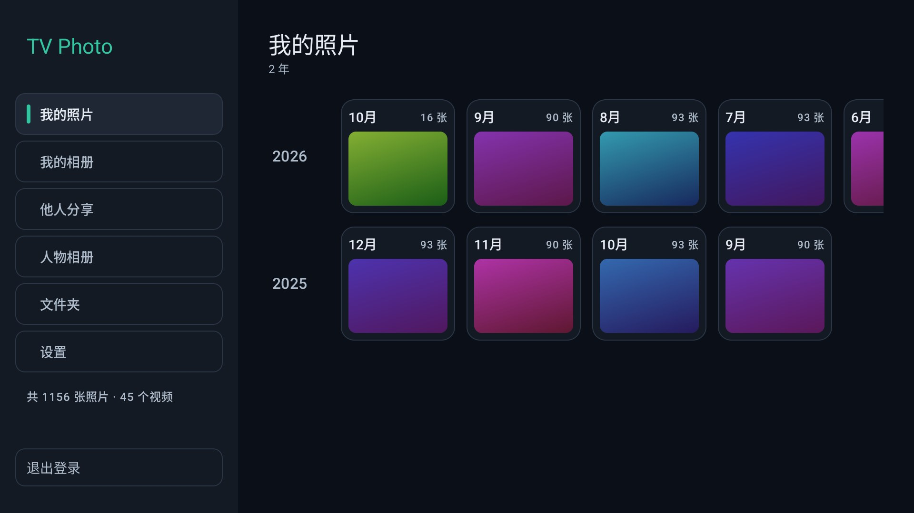
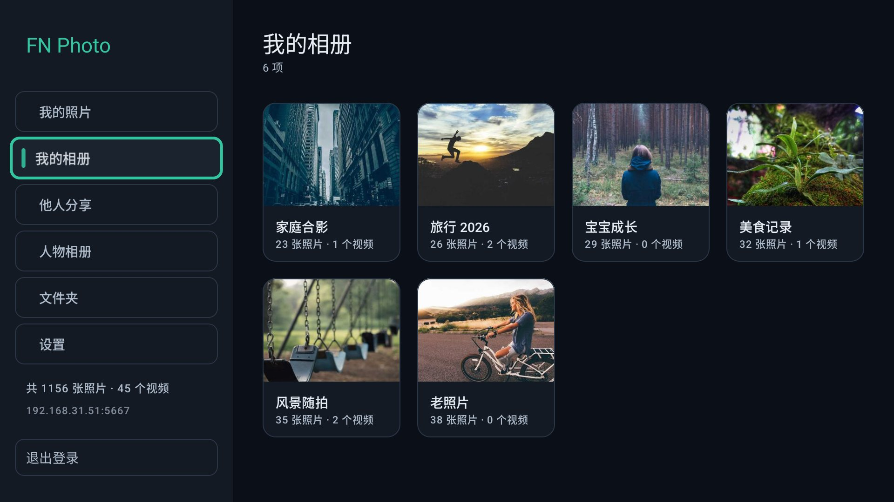
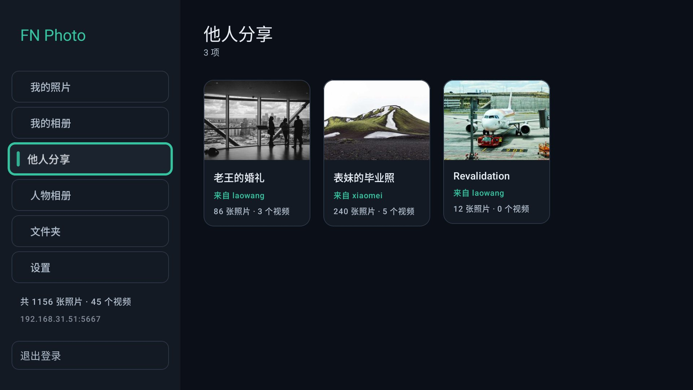
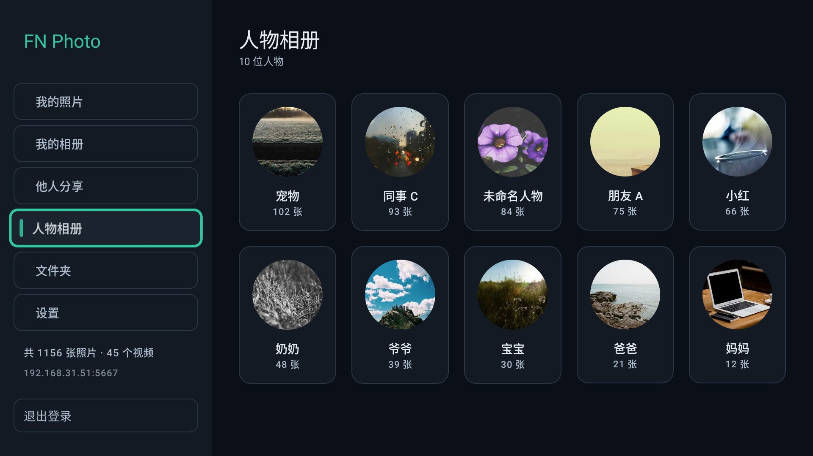
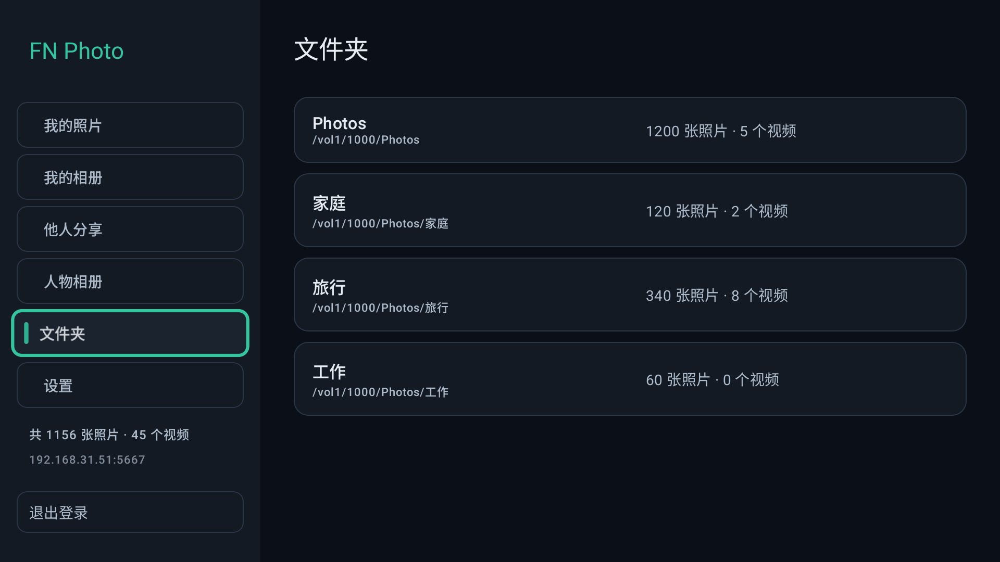
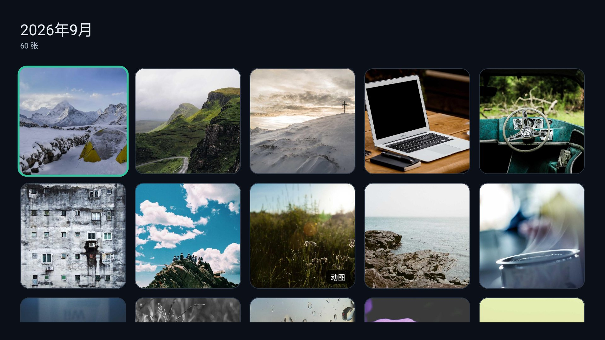
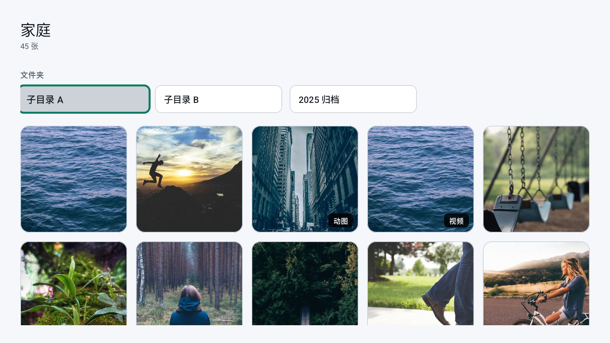
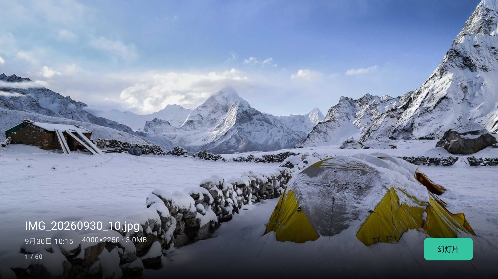
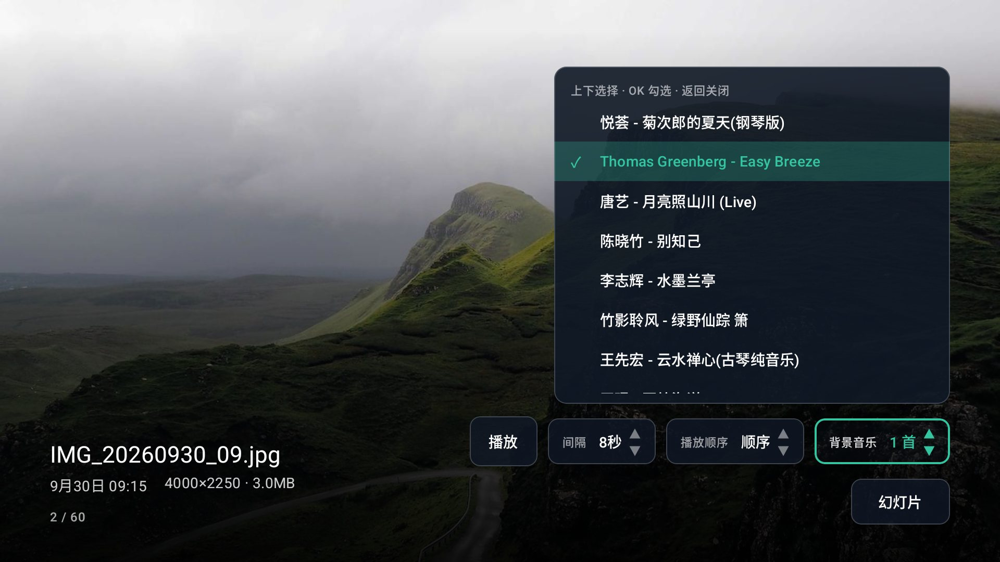

# FN Photo

**English** | [简体中文](README.md)

An Android TV app for browsing a photo library stored on a **飞牛 fnOS** NAS, driven
entirely by the TV remote.

It talks to the fnOS photo gallery's own API — the same one the official app uses —
so it gets the real timeline, albums, folders, server-side thumbnails, Live Photos
and video streaming, rather than treating the NAS as a dumb file share.


**The icon** is one sun and two ridges. Nothing is framed and nothing is outlined, so it
still reads at the small size a TV app list draws. The same artwork also ships as an
adaptive icon, which lets an Android 8+ home screen crop it to its own shape (circle,
rounded square); Android 6–7 gets a layer-list fallback, that being this app's floor.



## Screenshots

| | |
| --- | --- |
| **Timeline**<br> | **Albums**<br> |
| **Shared with me**<br> | **People**<br> |
| **Folders**<br> | **A month's photo grid**<br> |
| **Photos in a folder, with Live Photo / video badges**<br> | **Full-screen viewer with the info band**<br> |
| **Slideshow controls with the music list**<br> | **Paging queue arrows**<br> |

## What it does

- **我的照片 (the timeline)** — **one row per year, that year's months across it**. A row
  opens with the year, then a card per month: the month above, that month's first photo
  below. Months with no photos get no card. Left/right walks the months of a year, up/down
  moves between years, so a decade of library is a few dense rows instead of a
  screenful of near-empty year bars.
- **我的相册 (albums)** — user-created albums with covers and photo/video counts.
- **他人分享相册 (shared with me)** — albums other accounts on the NAS have shared
  with you, each card naming the account it came from. A route of its own
  (`album_grant/list_to_me`), not a filter on your own album list. An empty list is a
  normal state — it means nobody has shared one — so it says so rather than offering a
  retry.
- **People** — face clusters from the gallery's on-device AI, with circular face
  avatars. Hidden clusters are filtered out. An empty list is a normal state (AI
  indexing off), so it explains that instead of offering a retry.
- **Folders** — the folders the gallery app manages, with drill-down into
  subfolders and their media.
- **Party mode** — a running slideshow re-reads the album every **30 s**, so a picture a
  colleague sends to the album joins the rotation without anyone touching the remote,
  and one the host deletes leaves it. Arrivals are appended rather than re-sorted into
  their newest-first position: the show walks the list by index, so re-sorting would
  swap the photo on screen mid-display, and appending means each arrival is shown once
  per pass rather than being skipped as already passed. A photo that is no longer in the
  freshly-read page is dropped — see **A deletion leaves the show** below for how much
  one page can be trusted to say.
- **Fresh on entry** — selecting a section, and opening a photo grid, re-checks the
  list behind it, so an album someone shares with the account or a photo uploaded to
  the NAS turns up without restarting the app. Whatever is already on screen stays up
  while that runs: a re-check never blanks it, and a failed one never replaces working
  data with an error. A month whose photo count has moved also drops its cached cover.
- **Full-screen viewer** — fit-to-screen photos, left/right paging, an information
  band, and a slideshow. **Whether a preview draws the original file or the large
  thumbnail is decided by Settings → 预览原图**: the default, 仅用于幻灯片播放, draws the
  server's 1920px thumbnail while you page by hand — the tier the grid already fetched and
  the disk cache already holds — and fetches the original only for the slideshow. Over the
  internet that is the difference between the next photo arriving now and waiting on a
  multi-megabyte file; 是 makes every preview an original and 否 makes them all thumbnails.
  The band also says **which of the two is on screen** — at sofa distance they look alike,
  and this is the only place that can tell you; while it is a thumbnail, an **原图 button
  appears to the left of 幻灯片**, and pressing it makes the button breathe while the file
  is fetched behind the visible layer, swaps it in the moment it lands (no black frame),
  drops the button and turns the marker into 原图. That is "this one, at full size, now"
  rather than a setting: the next photo is a thumbnail again. The band's corner button
  opens slideshow controls — play,
  interval, order (顺序/随机) and background music — without leaving the photo. The show
  itself walks photos only: a clip in the rotation would stop the advance and talk over
  the music, so videos are looked past in either order. No permanent on-screen shortcut
  bar; toggling the slideshow shows a brief notice that dismisses itself.
- **A photo that has not arrived is not a black screen** — the viewer opens on a spinner
  and 加载中… until the first picture is decoded, and drops them the instant it is.
  Paging never needs them: the photo
  being left stays up until the next one is ready. The corner arrows are the other half of
  that rule — they report the user's own presses, never the show's own fetching.
- **Background music under the slideshow** — **背景音乐**, after 播放顺序 in the
  same row, opens a list of tracks above itself: up/down walks them, OK ticks and
  unticks, Back closes the list with the focus back on the control it came from.
  Four tracks are catalogued —
  four rows fit above the settings row, so the `MUSIC_LIST_MAX_HEIGHT` cap is no longer
  reached; it and the "scrolls itself to the cursor's row" are left over from a nine-track
  catalogue, where the list was taller than the room above the row and scrolling was something
  nothing else would do: the D-pad never touches those rows, the viewer's root box routes it.
  The music starts with the
  show, plays the ticked tracks in the order they are listed, loops, and stops with the
  show. It is *held* rather than discarded in the two places something else has the
  room's attention: while the settings row is open, which holds the photo timer for
  exactly the same reason, and while a video is on screen, which plays its own audio.
  Leaving the viewer ends it. The tracks travel inside the APK (14 MB of it) instead of being
  fetched from the NAS, because a soundtrack has to start with the show: a track that had to be
  authenticated and buffered first would put silence in front of every one. The catalogue used
  to hold nine tracks and 54 MB — four fifths of the whole package — and its three largest were
  slow instrumental pieces (水墨兰亭 12.9 MB, 云水禅心 11.5 MB, 绿野仙踪 箫 10.6 MB) worth 35 MB
  between them; 1.3.7 **deleted those files**, along with two more, and kept four: 菊次郎的夏天
  (钢琴版), Thomas Greenberg - Easy Breeze, 唐艺 - 月亮照山川 (Live) and 迎着风 向前冲. The
  package went from **65.8 MB to 25.6 MB**. Files rather than list entries, because a track
  nobody can select is still megabytes on every download — which is why `SlideshowMusicTest`
  now also fails the build when `assets/music` carries a file no catalogue entry names.
- **Dark or light** — **Settings → 主题** switches the whole app and remembers the
  answer. Dark stays the default, and the one a photo browser in a dim room wants; light
  is there because a bright room turns a dark UI into a mirror, and a TV is not always
  the only thing being looked at. The window is filled with the chosen background before
  Compose draws its first frame, so a light-mode launch does not flash black first.
- **Preview originals** — **Settings → 预览原图** has three options and OK cycles them,
  remembering the answer: **是** (every preview is the original), **否** (every preview is
  the large thumbnail) and **仅用于幻灯片播放** (the default). The first two speak for the
  whole app; the third splits them by occasion, because paging by hand wants the next
  photo now while a slideshow has seconds to spend and is the thing being watched closely.
  Moving to originals starts with the *next* photo: the one on screen is not fetched
  again. This is the default; wanting one photo at full size right now is the viewer's
  **原图** button instead, which leaves the setting alone.
- **Check for updates** — **Settings → 检测升级** asks Gitee and GitHub at once when the screen
  appears, and again on every OK. Both are asked because they are reachable from different
  halves of the world: Gitee from the domestic networks this app's users are on, GitHub from
  everywhere else. Whichever answers wins, the newer of the two answers wins over the faster
  one, and a source that never answers costs a three-second grace window rather than its whole
  timeout. Each source offers its release manifest first (version name, version code, APK URL,
  SHA-256) and falls back to the release tag, which is enough to name a version and nothing
  more. When that version is newer the row says **有新版本 x.y.z** and OK starts a download that
  is **verified against the manifest — and its signing certificate checked against this app's
  own key — before the system installer is ever handed the file**; a mismatch is deleted and
  reported, and an unverified APK is never passed on. Android 8 and up also wants the per-app
  "install unknown apps" grant, which the app asks for **before** downloading — spending 66 MB
  to discover the file cannot be installed is the worst failure a television can have. It
  deliberately **does not use either host's API**: GitHub's anonymous quota is 60 requests an
  hour per address and this project's own network had already spent it (403 in testing), and a
  failure the user cannot act on is worse than no check at all. Whenever a route is blocked,
  the row carries the manual one (the release page URL), because failing to install on this
  device should not mean there is no way forward. It also **writes out why it failed** — the
  exception name and message, or the HTTP status, with the time it took — because a television
  has no console and that row is the only place the reason can be read; "check failed" on its
  own is something nobody, including whoever wrote it, can act on.
- **The settings column scrolls** — there are now more rows than fit a 1080p screen, and
  the last one, 清除图片缓存, used to be cut off at the bottom edge: a rounded box with no
  text in it, which reads as a button that does nothing. It did clear the cache, but its
  value was drawn below the screen. Now the row focus lands on is scrolled into view, so
  nothing is cut off.
- **Paging never blanks the screen.** A page turn walks a *pointer* rather than jumping:
  pressing right moves the pointer one step, and until the photo it stopped on has
  actually been downloaded and decoded the photo on screen stays exactly where it is while
  a row of breathing arrows appears in the bottom-right corner — one per step the pointer
  was walked, so three presses right read as three arrows. **Only the photo the pointer
  stopped on is fetched**: the ones in between are steps that were walked over, not photos
  to be shown in turn, so three presses right land on the third, and the first two are
  never displayed and never downloaded. That matters most on a slow link, where the old
  queue turned every press into another download in front of the one that was wanted —
  which is indistinguishable from a freeze once a dozen presses have been banked. Left
  gives a step back instead of queueing a photo the other way: right-then-left takes that
  step back and leaves the pointer where it started, with the arrows gone. The moment the
  fetched photo is ready it becomes the photo on screen, in
  place of the one before it, with no black frame in between. Two image layers sit under
  the viewer at all times and a page turn only changes which one is opaque, because
  changing the *model* of the visible one is what used to blank the screen while the new
  photo downloaded.
- **A deletion leaves the show.** The 30 s re-read is compared with the list the
  slideshow is walking, and a photo the page no longer lists is dropped from the
  rotation instead of staying on screen as a picture that is no longer in the library.
  How much a single page can prove is read from the page itself: one that did not fill
  up reached the end of the album and speaks for all of it, while a full page only
  covers its own window — and anything the show appended itself is by construction among
  the newest photos, so its absence is conclusive even past that window.
- **Remembers where you were** — backing out of a photo returns to that photo in the
  grid, backing out of a grid returns to that month, and so on up the chain. The
  navigation rail does not steal focus back.
- **Video and Live Photos** — videos stream with seeking; Live Photos are badged
  and play their motion clip. The stream goes through the **same OkHttp client as the rest
  of the app**: the `AccessToken`, the access-code cookie, the pinned certificate trust and
  the timeouts are all the same ones, so a video plays on a NAS with a self-signed
  certificate exactly as the photos around it do. The player used to build its own
  connection, and that was the one path that skipped the pinned trust. Implemented in
  `data/OkHttpDataSource.kt`.
- **Fast viewing** — the cache is kept warm for the next 50 of **whatever is about to be
  shown** (the large thumbnail by default, the original when previews are set to originals
  or the slideshow is running), *starting from the photo you are on*, so paging forward is
  what gets accelerated. That
  window stands down completely while the viewer is waiting for a picture of its own —
  the one on screen, or the one a page turn just asked for — because a prefetch shares
  the client and the wire with the photo being looked at, and warming something nobody
  has opened yet must never be what makes that photo late. Measured on the emulator with
  previews set to originals, originals delayed by 12 s and a cold cache, the two seconds
  after the viewer opened
  carried **one** original request with the window held and **five** without it; once the
  photo landed the window resumed on its own. Media requests also run
  eight-at-a-time rather than OkHttp's default five, because the
  prefetcher and the thumbnails on screen share one client: with five, the pictures the
  user is looking at queued behind full-size originals nobody had asked for yet, which
  reads on a TV as the grid stuttering as focus moves.
- **Sign in once** — credentials are stored on submit, so even a *failed* attempt
  (wrong access code, NAS asleep) does not make you retype everything with a remote.
  They are remembered per **server + account**, not per server: one NAS with several
  accounts keeps each one's own password and 访问码, and the login screen offers them as
  one-press shortcuts. Typing a different account's name for the same address brings that
  account's password with it. Starting the app with a saved login shows a **loading
  screen**, not the login form: the form used to appear for a moment, take focus and ask
  the system for the on-screen keyboard, and then be thrown away the instant the sign-in
  landed. If the sign-in takes more than a few seconds the loading screen says so and
  offers the way out a remote can press — Back — which leaves the form, prefilled, with
  the server's own message on it.
- **Address only, HTTPS only** — the login field takes a server address such as
  `192.168.31.14:50317`; with no port it uses the fnOS secure default, 5667. There is no
  cleartext mode: a typed `http://` is folded to `https://`, so credentials never leave
  the TV in the clear.
- **The NAS certificate is trusted on first use.** fnOS serves a self-signed certificate
  (`O=fnOS CN=fnOS`) whose `subjectAltName` is `DNS:fnOS` — no IP, no name a user could
  type — so no stock HTTPS client can validate it, for two independent reasons. The app
  therefore remembers the fingerprint the first time it connects, and refuses a *different*
  one once: you are told the certificate changed and the next press of 登录 accepts it.
  These certificates last about three months, so a renewal is normal, not an attack.
  See [docs/fnos-photo-api.md](docs/fnos-photo-api.md#7-tls--the-self-signed-certificate).
- **FN ID sign-in was removed.** It resolved through the vendor's cloud, whose relay
  (`<fnid>.fnos.net:443`) answers every real path with a 302 to its own landing page and
  proxies nothing to the NAS, so that route could never carry the API. What a remote setup
  needs instead is in [docs/fnos-photo-api.md](docs/fnos-photo-api.md#6-fn-connect--removed).
- **访问码 (access code)** — if fnOS is configured to gate the login entry, the app
  passes that gate itself. The field only appears when the server actually asks for
  it. See [docs/fnos-photo-api.md](docs/fnos-photo-api.md#2b-the-访问码-access-code-gate).

## Image cache

| | |
| --- | --- |
| Ceiling | **5 GB**, LRU — the oldest entries are dropped automatically once exceeded |
| Contents | **Images only.** Video is streamed by Media3 with no cache configured, so a video file is never written to disk |
| Location | the app's `cache/image_cache` directory |
| Visible in | **Settings → 清除图片缓存**, shown as `已用 x / 5.0GB` |

Prefetching decodes at 1×1 on purpose: Coil writes the **full** response to the disk
cache before decoding, so the whole original is cached while only a single pixel is
ever held in memory. Asking for full-size decodes would mean fifty multi-megapixel
bitmaps in RAM for images the user may never open.

The window is anchored at the **current** photo and only re-anchors once the user
moves outside it — restarting on every focus change would cancel downloads already
in flight, so scrolling would starve the cache instead of filling it. Measured on
device with a cold cache: opening a grid fetched exactly **50 originals**
(ids 1015–1068), and moving 13 rows down fetched **37 new ones** (1066–1104).

## Crashing on a TV

A television has no console, so a crash there leaves exactly one piece of evidence —
that the app vanished — and the next launch starts from scratch. Uncaught exceptions are
therefore written to `files/last-crash.txt` and the first line of the last one is shown
in **Settings → 上次崩溃**, where somebody with a remote can read it out. The handler
installed to do that passes the failure on to whatever handler was already there, so a
crash still ends the process the way Android intends; it only records.

Two start-up paths that could once kill the process on their own are now contained: the
automatic sign-in with saved credentials, and Coil's disk cache. The second is the one
worth naming — a cache directory the system half-cleaned, a full volume or a journal left
behind by a kill made building the image loader throw, and because that happens lazily,
the throw landed inside the first image request, during composition. It now costs the
disk cache and nothing else: the app runs memory-only, and says so in the log.

## Remote control

| Key | Timeline / Albums / Folders | Viewer |
| --- | --- | --- |
| D-pad | move focus | — |
| ← / → | — | previous / next photo; picks a control when the slideshow row is open, or when both 原图 and 幻灯片 are in the corner |
| ↑ / ↓ | — | show / hide the information band; once up, they walk the corner: 原图 → 幻灯片 → the settings row; changes the value when a stepper is selected |
| OK | open the focused item | start / pause slideshow (play/pause for video); with the band up, operates the highlighted control |
| Back | up one level | close the slideshow row if it is open, otherwise leave the viewer |
| Back ×2 | exit the app (from the top level) | — |

Paging walks a pointer rather than jumping, so ← / → show where it has got to: arrows in
the bottom-right corner — pointing the way the pointer was walked, one per step it took —
breathing while they wait. Left takes a step back rather than queueing the photo behind, so
right-then-left reads as nothing queued, which is what a pointer back where it started is.
Only the photo the pointer stopped on is fetched: three presses right land on the third, and
the two in between are neither shown nor downloaded. Nothing about the list moves until that
photo is ready; then it becomes the photo on screen, and the arrows go with it.

**The arrows are for the user's own presses.** A running slideshow fetches its next
picture through the same walk, and reporting that would put code on screen that nobody
typed — so the queue remembers which of its entries the show asked for and counts only
the rest. Press ← or → during a show and the arrow is back, because that one *was* typed.

A photo that has not arrived yet used to be a black window, which says nothing about
whether anything is happening. The viewer now shows a spinner and 加载中… instead, and
drops them the moment the picture is decoded. It only ever appears when there is genuinely
nothing to look at: a page turn keeps the photo being left on screen until the next one is
ready, and a file the server could not produce is not "on its way".

The bottom band holds the photo's details on the left and a **幻灯片** button in the
corner. That button opens a row of controls above itself: play/pause, the interval
(3 s / 5 s / 8 s / 15 s / 30 s), the order (**顺序** / **随机**) and the background
music. Left/right picks a control and up/down changes its value. Both are remembered.
**The interval has this one entry point**: Settings used to carry the same row (1.3.7 removed
it — one setting with two doors, and it cost a row of height), and changing it here or there
stored the same preference, so nothing was lost with the row. The photo deliberately does not advance
while the row is open. Back closes the row and leaves the button up; a second Back leaves
the viewer.

**There can be two buttons in that corner, and up/down walks them.** When the photo on
screen is a thumbnail and the server sent an original, **原图** appears to the left of
**幻灯片** and the D-pad lands on it as the band opens — OK fetches the original: the
button breathes, the file is downloaded by the layer behind the visible one, and the
moment it arrives it is swapped in (no black frame), the button goes and the D-pad is back
on 幻灯片. ↑/↓ walk 原图 → 幻灯片 → the band itself (closing it), and ↑ from 幻灯片 is what
opens the settings row above. **While the 原图 button is up, ←/→ belong to that row** — the
same rule the settings row follows — switching between the two buttons instead of turning the
page: two buttons side by side are read as a row, and a row is what left/right move in. Paging
with the band open is a press of ↓ first, which closes it. With only 幻灯片 in the corner (the
original is already on screen, or a clip is) ←/→ page as they always did. A clip is not part of
this either: its "original" is the stream itself, which the player is already playing, so the
corner never offers 原图 for one and the band says nothing about quality.

**The show walks photos and nothing else.** A clip in the rotation would stop the advance
and talk over the music playing underneath it, so the next picture is chosen by looking
past videos — several in a row if that is what the library has, and in either order
(**顺序** walks; **随机** draws from the photos, so a run of clips cannot skew the pick).
A clip is still reachable by hand, and if one is on screen during a show it gets one
interval like everything else and the show moves on, rather than waiting for a stream that
may never play.

**背景音乐 is the one control that is not a value to step.** It is a multi-select, so OK
— or either arrow — opens the list of tracks above the row, where up/down walks the
tracks, OK ticks and unticks (applied at once; the tick is the confirmation), and Back
closes the list and puts the focus back on the control it came from. Left/right and the
photo keys do nothing while the list is up, so nothing moves underneath it. The list
scrolls to the row the cursor is on, since the catalogue is taller than the room above the
row and none of these rows is focusable.

**Setting controls all take one shape** — the slideshow row is the reference. A pill
reads `label · value · ▲▼`, with the label on the left and the arrows on the right of
the value, dimmed until the control is selected. Left/right moves between controls,
up/down changes the value and applies it at once, and OK steps it on. The arrows are the
point of the shape: they are what tells someone that up/down does something here. Do not
drop them, and do not stack them above and below the value — that costs a line of height
for no gain. (`ActionStepper` in `ui/viewer/` is the implementation; lift it into
`ui/components/` when a second settings surface needs it.) The music control keeps that
pill's geometry but opens a list instead of stepping: cycling one pill through "none,
this one, that one, both" would hide the ticks — the thing being decided — behind one
press at a time.

## Requirements

- Android TV or a TV box running **Android 6.0 (API 23)** or newer.
- A fnOS NAS reachable on the LAN **over HTTPS**, with the photo gallery service
  running — its secure web port, 50317 on the author's NAS and 5667 by default. The app
  has no cleartext mode, and the NAS's self-signed certificate is trusted on first use
  (see above).
- The fnOS account must be able to read the photos. The gallery app's **managed
  folders** are what appears under *Folders*; add them in fnOS if the list is empty.

## Install

A signed APK is on the GitHub release page, so building it is optional:

**<https://github.com/kungfucode-rex/fn-tv-photo/releases/latest>** — `FN-tvphoto-1.3.7.apk`,
25.6 MiB. The same release is mirrored on Gitee, which is the reachable one on a domestic
network: **<https://gitee.com/kungfucode/fn-tv-photo/releases/latest>**. The file also lands
in the share described below; these are one build.

Each release carries a **`version.json`** beside its APK — that is what 检测升级 in Settings
reads: version name, version code, APK URL and SHA-256, and it is the only thing that carries
a hash, so a release without one can be reported but never downloaded. A release build writes
it next to the APK (`tools/release-manifest.ps1`, run by `tools/build.ps1`; `-Site`/`-Repo`
produce the Gitee copy), and `tools/publish-gitee.ps1` creates the release there, uploads the
APK and commits the manifest to the repository, where the app reads it from
`gitee.com/<repo>/raw/<branch>/version.json` — Gitee serves no `latest/download` alias the way
GitHub does, so a file at a fixed path is the one address shape that needs no API call and no
tag lookup at check time.

To build it yourself:

```powershell
pwsh -File tools/build.ps1 -Tasks assembleRelease
# -> app/build/outputs/apk/release/FN-tvphoto-1.3.7.apk
#    and, in the same run, \\fnos-ms01\Temp\软件\FN-tvphoto-1.3.7-<stamp>.apk
```

A run that assembles an APK **uploads it to the share the TV is installed from** as well
(`tools/publish-apk.ps1`), reading the copy back to compare hashes. Building and publishing
are one step on purpose: the file on the NAS cannot then lag behind the source, and nobody
has to remember to copy it. Only **release** is published by default — the debug APK is for
the emulator, and a second file in a folder people install from is just a way to install
the wrong one. `-NoPublish` builds only, `-PublishVariants @('release','debug')` sends
both, and `-PublishDestination <path>` sends it elsewhere. A share that is asleep or not
authenticated does not fail the build — it warns, and the APK is still in
`app/build/outputs/apk/`.

The release APK is named after the app **and its version** rather than after the Gradle
variant — `FN-tvphoto-1.3.7.apk`. The version string is written once, as `appVersionName` in
`app/build.gradle.kts`; the manifest, the settings screen and the file name all take it from
there, so bumping the version renames the artifact with it. `app-release.apk` was the
alternative, and it says nothing about which app or which version the file is once it is
sitting in a TV's download folder. The name on the share then carries that APK's own **build
time** — `FN-tvphoto-1.3.7-<yyyyMMdd-HHmmss>.apk` — so an older build stays there to fall back
to and nothing is silently overwritten. The stamp comes from the file's timestamp rather
than the clock at upload, so re-publishing the same APK reuses the same name instead of
piling up duplicates. `tools/publish-apk.ps1` and `tools/tv.ps1` take the newest file
matching `FN-tvphoto-*.apk`, which is why neither script repeats the version. An
untimestamped file of the same name, or a leftover `app-<variant>.apk` from the earlier
scheme, is deleted, but **only** when it is provably the same bytes as the copy just
published; otherwise it is left alone and reported.

Both build scripts are deliberately **pure ASCII**. Windows PowerShell decodes a `.ps1` as
ANSI unless the file carries a UTF-8 BOM, so a literal `软件` in the script arrives as
mojibake and every copy fails with "share is not reachable" — which is exactly what happened
the first time this was written, and again as a mangled em dash in a warning message. The
share name is therefore assembled as `[char]0x8F6F + [char]0x4EF6`, and no message in either
script uses a character outside ASCII.

Then install it on the TV:

```bash
adb install -r app/build/outputs/apk/release/FN-tvphoto-1.3.7.apk
```

The release build is signed with `app/tvphoto.jks`. That keystore is **not** in
version control; generate one first (or let the debug build use its own key):

```powershell
keytool -genkeypair -v -keystore app/tvphoto.jks -alias tvphoto `
  -keyalg RSA -keysize 2048 -validity 10000 `
  -storepass tvphoto -keypass tvphoto `
  -dname "CN=TV Photo, OU=AndroidTV, O=TV Photo, L=Local, ST=Local, C=CN"
```

For a debug build use `tools/build.ps1 -Tasks assembleDebug` and install
`app-debug.apk`; note its application id is `com.kungfucode.fntvphoto.debug` (the
release one is `com.kungfucode.fntvphoto`; the code namespace is `com.tvphoto` either
way, which is why `tools/tv.ps1` names the activity as `com.tvphoto.MainActivity`).

The same APK also installs on a phone, with a normal desktop icon. `MainActivity`
declares `LEANBACK_LAUNCHER` for the Android TV home screen *and* the plain
`LAUNCHER` category that phone launchers enumerate, and `android.software.leanback`
is `required="false"` so the APK is not filtered off phones. Without the `LAUNCHER`
category the app installs and can be started by an explicit `am start`, but no
launcher ever shows it. On a phone the UI is still the forced-landscape, D-pad-first
TV layout.

## Project layout

```
app/src/main/java/com/tvphoto/
  data/
    fn/               fnOS protocol: crypto, signing, login, HTTP, endpoints
    AppContainer.kt   hand-rolled DI; one token source shared by API + media
    BaseUrl.kt        address normalisation (incl. full-width IME input)
    CrashLog.kt       keeps the last uncaught exception for the Settings screen
    UpdateChecker.kt  what the newest release is; the two sources asked at once
    ApkInstaller.kt   downloads the APK, checks its hash and its signature, hands it
                       to the system installer
    OkHttpDataSource.kt  the video player reads through the app's own OkHttp
                          client (token, access-code cookie, pinned trust)
    PreviewOriginal.kt   original or large thumbnail for previews, and which one
                          an install is set to
    SessionRepository.kt  login lifecycle, keepalive, re-login on expiry
    PhotoRepository.kt    the only data entry point the UI sees
    ThemeMode.kt      dark or light, and which one an install is set to
    SlideshowMusic.kt     the tracks that ship with the app, and how a
                          selection of them is stored and ordered
    SlideshowMusicPlayer.kt  ExoPlayer looping the ticked tracks under a show
  domain/Models.kt    UI-facing models
  domain/AppVersion.kt   how versions compare: the tag's leading v, missing segments, suffixes
  domain/PagingQueue.kt  the paging pointer: where the queue stands after one press
  domain/SlideshowOrder.kt  which picture a show moves to next: photos, skip the clips
  ui/
    login/ home/ gallery/ viewer/   screens
    components/Spinner.kt   the drawn arc, shared by start-up and by the viewer
    MainViewModel.kt  navigation stack + per-section state
    UpdateState.kt    the state machine behind the 检测升级 row
app/src/main/assets/music/   the four tracks a slideshow can play
tools/
  build.ps1           Gradle wrapper with the local toolchain; publishes the APK; writes version.json
  publish-apk.ps1     copies a built APK to \\fnos-ms01\Temp\软件 and verifies it
  release-manifest.ps1  writes version.json, for either site (-Site / -Repo)
  publish-gitee.ps1   creates the Gitee release, uploads the APK, commits the manifest
  tv.ps1              install / launch / screenshot / key injection
  mock-nas/           a mock fnOS server that enforces the real auth rules, plus
                      controls for timing- and change-dependent behaviour
                      (slow media, add/delete a photo, pin a signing rule)
    fetch-photos.js   fetches the test photos it serves (real photographs, not gradients)
    assets/photos/    those photos, one rendition per advertised thumbnail size, plus CREDITS.md
docs/fnos-photo-api.md   the reverse-engineered protocol, with evidence
```

## How this was verified

There is no way to unit-test a closed protocol against the real device from here, so
verification was built deliberately:

1. **A mock fnOS server that actually enforces the rules** — `tools/mock-nas`. Unlike
   the mock shipped with the reference project, it validates the `authx` signature,
   rejects a numeric `si`, and can be pinned to either signing rule at runtime. It serves
   **both** transports: cleartext on 5666 (what `verify.js` drives, and what is easiest to
   read raw traffic from) and TLS on **5667**, with a self-signed `O=fnOS CN=fnOS`
   certificate whose `subjectAltName` is `DNS:fnOS` — the same shape a real NAS presents,
   so the client's first-use trust path is exercised rather than bypassed. Point the app at
   `10.0.2.2:5667` to run it against the mock. The photos it serves are the 60 **real
   photographs** in `tools/mock-nas/assets/photos/` (`node fetch-photos.js` downloads them;
   the Unsplash Licence and a per-photo source list live in the `CREDITS.md` beside them) —
   the mock used to paint one gradient per photo, which is enough to assert that a thumbnail
   arrived and useless in a screenshot anyone else is meant to look at.
2. **An independent reference client** — `tools/mock-nas/verify.js` re-implements the
   protocol from scratch and asserts that the matching rule is accepted while the
   non-matching one is rejected with `5000`, plus that the login handshake works over
   `wss` on the TLS port. Run it before trusting any conclusion drawn from the mock:

   ```powershell
   cd tools/mock-nas
   npm install
   node server.js          # terminal 1
   node verify.js          # terminal 2
   ```

   It already caught one real bug in the mock itself (the encoded candidate included
   a leading `?` that clients do not sign).
3. **On-device runs on an Android TV emulator** — every screen and remote action was
   exercised against the mock, with screenshots kept locally in
   `artifacts/screenshots/` (**not committed**; re-running the app regenerates them).
4. **A negotiated-signature test** — with the mock pinned to the rule the client does
   *not* start on, requests are rejected, the client flips rule, retries, succeeds and
   persists the choice. Confirmed by reading both the server counters and the app's
   stored preference.
5. **Unit tests** for address normalisation: `pwsh -File tools/build.ps1 -Tasks testDebugUnitTest`.
   These caught a real bug where `trimEnd('/')` turned `http://` into `http:`.
6. **Controls on the mock for the timing-dependent behaviour** — a viewer that keeps the
   current photo up while the next one downloads cannot be checked by reading code, and
   on a LAN the wait is too short to see. `__control/slow-media?ms=12000&sizes=o` makes
   originals arrive twelve seconds late, and `__control/delete-photo?id=N` removes a
   photo the way a host tidying up a party album would. Neither changes what the protocol
   looks like — only how long it takes, and what the next read of the library contains.

   That is how the paging queue and the deletion path were both confirmed on the
   emulator: with a slow original, queueing 7 page-turns leaves the picture on screen
   with five arrows and a `+2` overflow in the corner, and the
   photo the pointer stopped on replaces it when it lands — a black frame
   would have shown up in either. (Every press used to be queued and shown in turn; only
   the pointer's photo is fetched now, see item 11.) Uploading to the running slideshow
   moved the count in
   the information band from `4 / 16` to `4 / 17`, and deleting that same photo moved it
   back to `4 / 16` two polls later.

   The slow-media control found a real bug in the first cut of the queue: the photo
   *behind* the visible one is often the very photo the queue is waiting for — paging
   back is the obvious case — and that layer had already loaded it, so no load callback
   was ever going to fire and the arrow sat there forever. Each layer's readiness is now
   recorded against the URL it actually decoded, and pointing a layer at something else
   drops that claim.
7. **The theme and the soundtrack, on the device** — neither can be read out of the code.
   The theme was toggled from **Settings → 主题** and then walked through: the settings
   screen, the timeline and a month grid in light, and the same app after a
   restart, which came back light because the window had been filled with the light
   background before Compose drew; the same row switched back looks the same.
   The viewer stays dark in both modes — it
   is a surface over a photograph, not over the app. The music was walked the way a
   remote walks it: the list opening above the row, a tick, the same
   press taking it off again, both tracks ticked, the list closing with
   the focus still on the control it came from, the row closing without starting
   anything, left/right doing nothing at all underneath the list — that press
   left the frame byte-identical to the one before it — and the same two ticks still
   there after a restart.

   The audio itself was read from the device rather than inferred. With the show running,
   `dumpsys audio` lists `pack: com.tvphoto.debug` holding `USAGE_MEDIA /
   CONTENT_TYPE_MUSIC` focus through `media3`'s `AudioFocusManager`, and the `AudioOut_D`
   thread is out of standby; after stopping the show, and again after leaving the viewer
   mid-show, that focus entry is gone and the thread is back in standby. Focus alone does
   **not** distinguish playing from paused — `media3` keeps it while a paused player sits
   in `STATE_READY` — so the pause paths were read from the output thread instead: with
   the settings row open the thread drops to `0 active` tracks and standby, and returns
   to one active track when the row closes. The same measurement with the show parked on
   a video also reads `0 active`, which is the only track
   count that could be the music there — the mock's video carries no audio stream of its
   own (`soun` and `mp4a` boxes absent), so an active track on it could only have been
   the music. What is *not* waited out on a device is a full pass of two four-minute
   tracks: that the ticked tracks play in the order they are listed, and loop, is pinned
   by `SlideshowMusicTest` (the selection is stored in catalogue order, whatever order it
   was ticked in) and by the player's `REPEAT_MODE_ALL` over that playlist.
8. **The three viewer rules that only show up against a slow or mixed library** —
   `__control/slow-media?ms=30000&sizes=o` with the image cache emptied makes a photo take
   half a minute, which is the only way to see any of these. The black window is a spinner
   while that runs and the picture replaces it with nothing left over.
   With the same delay and a show running, the corner is *empty* while the show's
   own next photo is in flight and shows an arrow the
   moment a key is pressed — one press, one arrow, from a
   queue that held both. And with 顺序 set, stepping through a month whose clip sits at
   `4 / 16` reads `1 → 2 → 3 → 5 → 6 …`: the clip is walked over, and the position trace
   never once reads `VID_`. Stepping onto that clip by hand while the show runs does not
   stall it either — it gets one interval and the show is on the next picture.
   `SlideshowOrderTest` pins the same rules off the device, over every seed for the
   shuffled draw.
9. **The paging pointer, the prefetch window and the track catalogue** — the three
   changes that only exist on screen. `__control/slow-media?ms=12000&sizes=o` with the
   image cache emptied puts the pointer walk somewhere a screenshot can catch it:
   one press right is one right arrow, the next press left takes that step back
   and leaves the corner *empty*, and only the press after that puts a left arrow
   up — the old queue read that second press as two leftwards arrows. Repeating it
   both ways counts down and cancels out as a pointer should.
   The prefetch's new hold was measured rather than eyeballed, by reading the mock's
   request log: in the two seconds after the viewer opened on a cold cache it carried
   **one** original — the photo on screen — where the same build with `hold = { false }`
   sent **five**, the visible photo twice over plus three prefetches (`/__control/media`).
   Fourteen seconds later, with the photo landed, the window had resumed on its own (five
   originals). The music list was walked with nine tracks in it (that run predates 1.3.7, which
   cut the catalogue to four): it opens on the
   ticked row, scrolls itself to the last one, ticks it and takes
   the ticks off the two that shipped before. That last state — exactly one track
   ticked, one of the new seven — was then played, and read off the device the way item 7
   reads the audio: `media.audio_flinger` reports `1 Tracks of which 1 are active` for
   `com.tvphoto.debug` with `Standby: no`, and the log carries `ExoPlayerImpl`'s init and
   an audio `MediaCodec` being built for it, with nothing about a missing asset.
   `SlideshowMusicTest` is what keeps the catalogue honest off the device: it fails the build
   if any name in the catalogue is a file the APK does not carry, and — added in 1.3.7, when the
   catalogue went from nine tracks to four — it fails just as loudly when `assets/music` carries
   a file no entry names. Dropping entries is a one-line edit; dropping the audio is the part
   that is easy to forget, and 35 MB of unselectable music would then ride along in every
   download.

10. **The icon** — no test proves a picture looks right, so the new one was rendered and
   looked at before it became a vector: drawn at 512 / 192 / 96 / 48 px, then masked with a
   circle and a rounded square, which is what a home screen crops an adaptive icon with.
   After the build, `aapt2 dump badging` confirms `application-icon` resolves to
   `res/mipmap-anydpi-v26/ic_launcher.xml` and that the APK also carries the API 23–25
   fallback; the system's own drawing of it was checked in the TV emulator's
   **Settings → Apps** list.

11. **Preview originals, one-photo paging and the video's TLS trust, walked on the
    emulator against the mock** — all three only exist on screen. The new 预览原图 row was
    walked: the default is 仅用于幻灯片播放, OK steps it to 是 → 否 and back round, and the
    choice is persisted. That it really decides which tier is fetched was measured, not
    assumed, by reading the mock's request log (`/__control/media`): under the default the
    viewer and its prefetch window send only `/m/` (the 1920px large thumbnail) and not a
    single `/o/`. Paging was walked again on a cold cache — image cache emptied, app
    restarted, and the first entry of the month opened (the mock puts a clip there; the
    front layer was still fetching and the prefetch window was standing down, so the log
    held nothing but the viewer's own traffic). Three presses right later the information
    band read `4 / 15`: the pointer walked three steps, only the third photo was fetched,
    and the two in between were neither shown nor ever asked for — the old queue fetched
    them and showed them one after another. The video was opened against an
    **HTTPS mock with its self-signed certificate**: the mock logged
    `/p/api/v1/stream/v/1000`, `logcat` carried `ExoPlayerImpl Init` and
    `c2.goldfish.h264.decoder` decoding, and the screen showed the video's own frame —
    where this path used to fail with `Trust anchor for certification path not found`. The
    清除图片缓存 row was walked to and pressed too, and answered 缓存已清除: it used to be
    cut off past the bottom edge, a rounded box with no text in it. The paging rule, the
    preview tier and `stillUrl`'s fallbacks also live off the device, pinned by
    `PagingQueueTest` (9), `PreviewOriginalTest` (4) and `StillUrlTest` (8) under
    `testDebugUnitTest`.

12. **The 原图 button, followed frame by frame** — this one is only provable on screen,
    because it is about what is *on* the screen while something is being fetched. With the
    mock's originals delayed by five seconds (`__control/slow-media?ms=5000&sizes=o`):
    pressing ↑ opened the band, the details read **缩略图**, and the D-pad was already on
    the **原图 button to the left of 幻灯片**; pressing OK added exactly **one** `/o/` to the
    mock's request log (the prefetch window stood down with it, so there was no other
    traffic) and started the button breathing — two screenshots a second apart show it
    dimming and brightening, with the photo itself **never leaving the screen**, so no
    black frame. Five seconds later the original landed, the same photo was swapped in
    place (still `1 / 15`), the **原图 button was gone**, the marker read **原图** and the
    D-pad was back on 幻灯片. Paging on to the second photo put the marker back to 缩略图
    and the button back in the corner (←/→ still page), and stepping onto the clip offered
    neither — its original is the stream already playing. `StillUrlTest` pins the two
    premises of that rule off the device: one URL serving both tiers counts as the original
    and offers no button, and a clip never has an original still to move to. **Where ←/→
    belong** was settled on that emulator too: on `1 / 15`, ← moved the highlight to 幻灯片
    with the photo **standing still** and → brought it back to 原图 (with both buttons up,
    left/right are that row's), while with only 幻灯片 in the corner — the clip parked on
    `3 / 15` — → still turned the page, landing on `4 / 15`.

13. **Check for updates, walked the way a user would** — the routes are things only a screen can
    prove. **Against the real hosts**: entering the settings screen checks by itself, and a
    television whose network blackholes github.com still gets an answer, because Gitee is asked
    at the same time and answers in about 0.25 s where GitHub takes 0.7–1.2 s. Pointing a source
    at a repository that does not exist is what puts **检查失败** and 按 OK 重试 on screen; the
    row also carries the elapsed time and the exception, which is what turned "it fails" into
    "it blackholes the connection, and the twenty-one seconds were a sequenced pair of
    timeouts" — a real television's report, and the reason the two sources are now asked at
    once with a three-second grace window rather than one after the other.
    **Download, verification and install** need a manifest with a SHA-256, so that part was fed
    by a local HTTP server serving a manifest and an APK in exactly that shape, with the app's
    URL constant pointed at it for the run and reverted afterwards. That run went: **有新版本**
    with the manual fallback text → OK hits **需要允许安装** first, because the system grant was
    off (so it did not spend 66 MB to find out) → OK opens the system "install unknown apps"
    panel, the switch goes on → OK again → **正在下载 50%** → the system installer opens by
    itself asking to update the app, with the verified file where it should be and its byte count
    equal to the manifest's `sizeBytes` → cancelling and pressing OK again **reopens the
    installer with the file's timestamp unchanged**, so nothing was downloaded twice → and with
    the manifest's SHA-256 replaced by a wrong value, **安装包校验失败** with the mismatching file
    **not on the disk**. The Gitee round was then verified the same way end to end: an anonymous
    download of the published asset, 25.6 MiB in 12.5 s, hashing to the manifest's value.
14. **The signature check, and the bug a real television found in it** — the check was written
    to refuse an APK not signed by this app's own key, which is what lets the manifest come from
    a mirror. It shipped in 1.3.5 and refused a genuine update on the author's own TV with
    **安装包签名不对**. The cause was a platform asymmetry: `getPackageArchiveInfo` collects an
    APK's certificates **only when the older `GET_SIGNATURES` flag is passed**, so asking for
    just `GET_SIGNING_CERTIFICATES` returns a `PackageInfo` whose signing details were never
    filled in — while the *installed* package answers from the package manager's database either
    way. Empty was then read as "signed by somebody else". Three things changed: both flags are
    passed, the older field is read when the newer one comes back empty, and **"not readable" is
    no longer "different"** — only a definite mismatch refuses, because blocking a genuine update
    is worse than the risk being guarded against, and the installer enforces the rule regardless.
    Verified on the emulator by serving a manifest that describes a debug-signed APK to a
    debug-signed build: the verdict is *same*, the installer opens, and the log carries no
    "cannot read the certificate" line — which is how the two outcomes are told apart, since both
    would otherwise look identical on screen. The off-device half is pinned by `AppVersionTest`
    (13 — the tag's leading `v`, missing segments, pre-release suffixes, unreadable strings, and
    "a release ahead on either the name or the version code is an update") and
    `UpdateCheckerTest` (11 — a manifest missing fields, a hash in lower case or with spaces, an
    error page read as a manifest, no release yielding a version scraped out of a path, and two
    sources that answer differently offering the newer release rather than the faster one).

Two bugs were found only by testing the way a user actually would:

- **Credentials were never written to storage.** Auto-login silently never happened.
  Earlier runs passed only because the preferences had been seeded by hand — a good
  reminder that a hand-seeded fixture can hide a broken happy path.
- **A Chinese IME renders `.` as `。`.** Typing `10.0.2.2` could store
  `10。0。2。2`, which only connected because the URL stack's IDN nameprep happened to
  fold it back. The input is now normalised explicitly.

And one found by reporting a symptom rather than reading code:

- **Sign out, sign in again → `errno 401`.** Request ids embed a session id returned
  by login, but the generator is a process-wide singleton that outlived the
  sign-out, so the second handshake advertised the *previous* session's id. The mock
  server had silently accepted this because it ignored `reqid` entirely — a mock is
  only as strict as the fields it checks. It now enforces session-id freshness and
  `verify.js` asserts the rejection, so dropping `FnReqId.reset()` makes the flow
  fail loudly instead of regressing quietly. The login error also now includes the
  server's own wording, since a bare `errno 401` is not actionable.

And one found by pointing the app at a real NAS for the first time:

- **The device was gated by 访问码.** The WebSocket upgrade returned a bare `401`,
  which looks like a credential problem and is not. The gateway's
  `X-Trim-Safe-Code-Challenge` header gives it away, and the challenge page's own
  script reveals the `/access_code_verify` exchange. Support for it was implemented
  from that, so the app works *without* asking the user to weaken their NAS security —
  which would have been the lazy fix.

## Known limitations

- **The protocol is private and unversioned.** The signing salt/secret are global
  constants lifted from the fnOS frontend, and v1 and v2 endpoints already coexist.
  A server-side change can break this app. See
  [docs/fnos-photo-api.md](docs/fnos-photo-api.md) for the risk assessment and the
  WebDAV alternative.
- **The password is stored in plain `SharedPreferences`.** This is forced by the
  absence of any refresh-token flow: recovering from an expired `AccessToken`
  requires replaying the full login. For a LAN appliance app this is a deliberate
  trade-off, but it is worth knowing.
- **Read-only.** Browsing, viewing and slideshow are implemented; delete, upload,
  rename and favourites are not.
- **No pinch-zoom or pan** in the viewer.
- **A deletion deep inside a long list is noticed late.** The 30 s re-read is one page,
  so it can only vouch for its own window: a photo deleted below that window leaves the
  rotation on the pass that shrinks the list far enough for the window to reach it. A
  slideshow normally holds exactly one page — the viewer never pages in more — so in
  practice the window is the whole list; the gap needs a list longer than one page, which
  means a grid that was scrolled to the end before the viewer was opened.
- **A release has to be published to both places.** The app asks Gitee and GitHub and takes the
  newer answer, so a release published to only one of them is offered by whichever was updated
  and *not* by the other — for a while the two carried different versions, which is survivable
  and was useful as a test, but keeping them in step is the rule.
- **Installing from inside the app needs one system grant.** Android 8 and up must first be told
  this app may install apps, and every install still has to be confirmed by the user on the
  system installer's own screen — deliberately; the app never installs anything silently. Some
  TV firmware (or a device-managed box) has no usable installer at all, and then only the manual
  route is left.
- **Only tested against the mock server**, not a physical NAS. The protocol follows
  two shipping implementations, but a real device may still differ in details.
- The `POST /p/api/v1/photo/collect` favourites endpoint and the AI features
  (people, places, search) exist in the API but are not surfaced in the UI.

## Development toolchain

`tools/setup-toolchain.ps1` provisions a self-contained JDK 17 + Android SDK +
Gradle under `F:\android-toolchain`, so nothing is installed system-wide and the
whole thing can be deleted in one step. `tools/setup-emulator.ps1` and
`tools/create-avd.ps1` add an Android TV system image and an AVD.

One environment note worth recording: every Gradle distribution URL redirects to
`github.com`, which was unreachable from this network. The toolchain script uses the
Tencent mirror instead.
